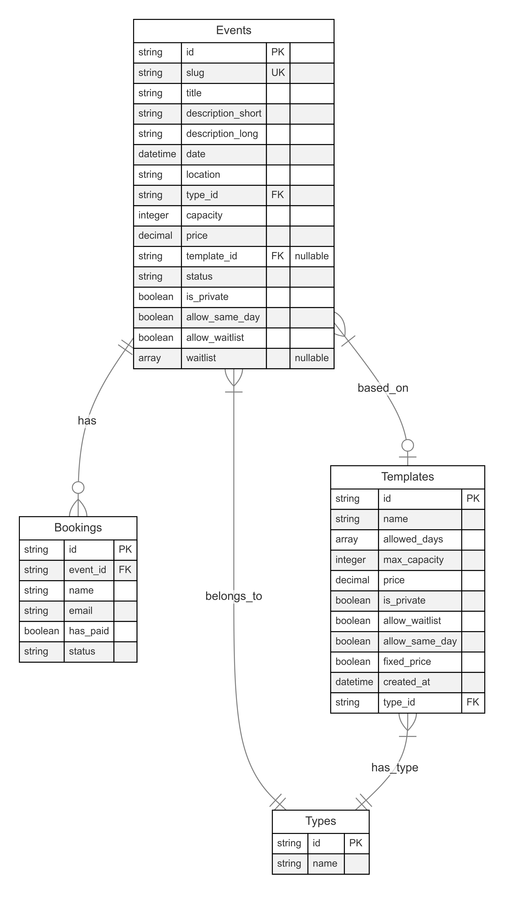

# Oppgave 2

## 1: Wireframes

[Se Wireframes(PDF)](./files/wireframes.pdf)

## 2,3,4: Endepunkter, verb og responser:

### /events - alle arrangementer

- GET
  - Formål: Hente alle arrangementer, mulighet for filtrering basert på parametere
  - Respons: Array med arrangement-objekter
  - Statuskoder:
    - 200: Success
    - 500: Server error
- POST:
  - Formål: Opprette nytt arrangement
  - Statuskoder:
    - 201: Created successfully
    - 400: Validation error
    - 500: Server error

### /events/:slug

- GET
  - Formål: Henter et arrangement basert på slug, som gir en penere url enn å hente ut med id
  - Respons: Ett enkelt arrangement-objekt
  - Statuskoder:
    - 200: Success
    - 404: Event not found
    - 500: Server error

### /events/by-id/:eventId

- GET

  - Fårmål: Henter spesifikke arrangementer basert på ID
  - Brukes i hovedsak internt i applikasjonen
  - Respons: Ett enkelt arrangement-objekt
  - Statuskoder:
    - 200: Success
    - 404: Event not found
    - 500: Server error

- PATCH

  - Formål: Oppdatere utvalgte elementer ved et arrangement
  - Respons: Ett enkelt arrangement-objekt
  - Statuskoder:
    - 200: Updated successfully
    - 400: Validation error
    - 404: Event not found
    - 500: Server error

- DELETE
  - Formål: Slette arrangement fra databasen
  - Respons: Suksessmelding 200
  - Statuskoder:
    - 200: Deleted successfully
    - 400: Event has bookings
    - 404: Event not found
    - 500: Server error

### /bookings

- GET

  - Formål: Hente alle påmeldinger
  - Respons: Array med påmelding-objekter
  - Statuskoder:
    - 200: Success
    - 500: Server error

- POST

  - Formål: Opprette ny påmelding
  - Respons: Ett enkelt påmeldingsobjekt (ved flere på en gang håndteres de hver for seg)
  - Statuskoder:
    - 201: Created successfully
    - 400: Validation error/Event full
    - 500: Server error

  ### /bookings/:slug

- GET
  - Formål: Hente påmeldiger for ett arrangement
  - Respons: Array med påmeldingsobjekter
  - Statuskoder:
    - 200: Success
    - 404: Event not found
    - 500: Server error

### /bookings/:bookingId

- PATCH

  - Formål: Oppdatere påmeldingsstatus
  - Respons:
    ```typescript
    {
      status: "Godkjent" | "Til behandling" | "På venteliste" | "Avslått";
      has_paid?: boolean;
    }
    ```
  - Statuskoder:
    - 200: Updated successfully
    - 404: Booking not found
    - 500: Server error

- DELETE
  - Formål: Slette påmelding
  - Respons: Suksessmelding 200
  - Statuskoder:
    - 200: Deleted successfully
    - 404: Booking not found
    - 500: Server error

### /templates

- GET

  - Formål: hente alle maler
  - Respons: Array med mal-objekter
  - Statuskoder:
    - 200: Success
    - 500: Server error

- POST
  - Formål: Opprette ny mal
  - Respons: Statuskode 201
  - Statuskoder:
    - 201: Created successfully
    - 400: Validation error
    - 500: Server error

### /templates/:templateId

- GET

  - Formål: Hente en spesifikk mal via mal-id
  - Respons: Ett enkelt malobjekt
  - Statuskoder:
    - 200: Success
    - 404: Template not found
    - 500: Server error

- PATCH

  - Formål: Oppdatere mal
  - Body: Updated template fields
  - Respons: Updated template object
  - Statuskoder:
    - 200: Updated successfully
    - 404: Template not found
    - 500: Server error

- DELETE
  - Formål: Slette mal
  - Respons: Statuskode 200
  - Statuskoder:
    - 200: Deleted successfully
    - 409: Template in use
    - 404: Template not found
    - 500: Server error

### /types

- GET
  - Formål: Hente alle arrangementtyper
  - Respons: Array med type-objekter
  - Statuskoder:
    - 200: Success
    - 500: Server error

## 5: Sidestruktur

### / (Hjem)

- Viser liste over alle ikke-private arrangementer
- Kan filtrere på måned, år og type
- Linker til individuelle arrangement-sider

### /events

- Viser liste over alle arrangmeneter
- Filtrering på type arrangment, måned og år
- Status fullbooket/ledige plasser

### /[slug]

- Detaljer om et spesifikt arrangement som tittel, tidspunkt, sted, pris, antall plasser
- Statusindikator fullbooket/ledige plasser
- Påmeldingsskjema:
  - Om gratis kan man melde seg på og automatisk få godkjent så lenge det er plass på arrangementet
  - Om venteliste er aktivert for arrangementet, blir yttligere påmeldinger lagt der
  - Er det et betalt arrangement, får man status "til behandling", og admin må godkjenne denne manuelt

### /admin

- Arrangementer:
  - kan se alle arrangementer
  - kan opprette nytt arrangement, redigere et eksisterende arrangememnt, eller slette et arrangeemnt som ikke har påmeldinger
- Maler:
  - Kan se alle maler
  - Kan opprette nye maler, eller slette maler som ikke er i bruk
- Påmeldinger:
  - Kan laste ned en excel-fil med alle påmeldinger per år
  - Kan se alle arrangementer og en oversikt over dets påmeldinger, linker til håndtering av påmeldinger

### /admin/[slug]/bookings

- Håndterer påmeldinger for det individuelle arrangementet
- Kan legge til en påmelding manuelt
- Kan godkjenne, avslå og slette eksisterende påmeldinger
- Kan markere et betalt arrangement som betalt eller ikke per påmelding

## 6: Filtrering:

#### Frontend:

Filter-komponentet setter opp tre dropdrowns, som inneholder verdier. Når en av disse verdiene velges av brukeren, blir URL-parameterne oppdatert til å inneholde denne verdien, eksempelvis slik: `http://localhost:4000/?month=11&year=2025`.
Når URL-en endres, fetcher EventList-komponenten ny data basert på parameterne. Slik kan filtrerte resultater lett deles og bokmerkes.

#### Backend:

Endepuktet `/events` tar imot query-parametere fra frontend. Controlleren skiller ut parameterne,og sender dem til servicelaget. Repoen bygger en dynamisk SQL-query basert på de valgte filterne, og returnerer data som mathcer disse filterne.

## 7: Datamodell:



### Begrunnelse:

- Separerer data inn i naturlige entiteter, hvor hver entitet har en tydelig rolle i dataflyten.
- Events og Templates har en viss overlapp i felter, for å kunne operere både i samsvar og separat.
- Redundans kan yttligere unngås ved å opprette oppslagstabeller for statuser, tillate dager o.l., slik som "Types" fungerer som. Datamodellen er derfor fremtidsrettet og kan utvides ved behov.

## 8: Malsystemet:

- Opprettes gjennom administrasjonpanelet. Navn og type velges. Ukedager kan velges for å opprettholde regler rundt dager. Avhukingsbokser låser et arrangement til å benytte samme innstillinger om malen brukes som grunnlag for arrangementet.

- Gjenbruk: Kan velges fra en drop-down i arrangementskjema. Om en mal velges, vil enkelte felter, som type, kapasitet og pris auto-fylles. Dato må samsvare med dager satt i malen. Enkelte felter kan overstyres, basert på den enkelte malens innstillinger. I till skal ikke maler som er i bruk kunne slettes eller endres.

## 9: Databasemodell og relasjoner:

Fire hovedtabeller: Events, Templates, Types og Bookings, basert på datamodellens entiteter.
Fremmednøkler benyttes for å refere mellom tabeller.

- Event og Templates har en én-til-mange-relasjon siden mange arrangementer kan opprettes fra én mal, men en mal kan benyttes til mange arrangementer. `template_id` i Events referer til Templates.
- Event og Bookings har en én-til-mange-relasjon, siden mange påmeldinger kan tilhøre ett arrangement, men en individuell påmelding kun gjelder det ene arrangementet. `event_id` i Bookings referer til Events.
- Types og Events har en én-til-mange-relasjon, siden et arrangement kan bare ha én type, men en type kan tulhøre mange arrangmeneter.
- Types og Templates har en én-til-mange-relasjon, da en type kan tilhøre mange maler, men en mal kan kun ha én type. `type_id` i både Events og Templates referer til Types.
